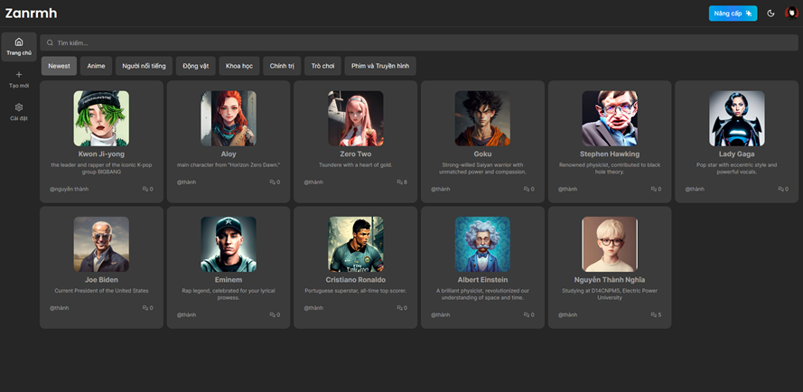

# Xây Dựng Thị Trấn Giao Lưu Ảo Dựa Trên AI



## Tổng Quan

Dự án này, với tên gọi "Xây Dựng Thị Trấn Giao Lưu Ảo Dựa Trên AI," là một nền tảng tương tác ảo độc đáo dựa trên AI. Phát triển như một phần của đồ án tốt nghiệp tại Trường Đại học Điện Lực, dự án tích hợp công nghệ AI và Công nghệ Thông tin mới nhất để mang lại trải nghiệm game và tương tác độc đáo.

## Tính Năng

- Thiết kế với Tailwind
- Tính năng phản hồi đầy đủ
- Xác thực người dùng với Clerk (Email, Google, 9+ Đăng nhập Xã Hội)
- Xác thực và xử lý form khách hàng với react-hook-form
- Xử lý lỗi server với react-toast
- Công cụ tạo hội thoại (Open AI, Replicate)
- Đăng ký gói hàng tháng với Stripe
- Gói miễn phí với giới hạn API
- Cách viết route POST, DELETE, và GET trong route handlers (app/api)
- Cấu trúc thư mục trong Next 13 App Router

## Công nghệ sử dụng

- [Next.js](https://nextjs.org/): Dùng cho phát triển giao diện người dùng và xử lý chức năng ở phía client.
- [Tailwind CSS](https://tailwindcss.com/): Để thiết kế và tùy chỉnh giao diện.
- [Prisma](https://www.prisma.io/): Là công cụ quản lý cơ sở dữ liệu.
- [Stripe](https://stripe.com/): Dùng cho xử lý thanh toán và đăng ký dịch vụ.
- [OpenAI](https://platform.openai.com/apps) và [Replicate](https://replicate.com/): Có thể sử dụng OpenAI cho các tính năng như chatbot,.
- [Clerk](https://dashboard.clerk.com/): Sử dụng giải pháp cho việc đăng nhập và quản lý người dùng an toàn.

## Biến môi trường

Để chạy dự án này, bạn sẽ cần thêm các biến môi trường sau vào tệp .env của mình

`NEXT_PUBLIC_CLERK_PUBLISHABLE_KEY=`

`CLERK_SECRET_KEY=`

`NEXT_PUBLIC_CLERK_SIGN_IN_URL=/sign-in`

`NEXT_PUBLIC_CLERK_SIGN_UP_URL=/sign-up`

`NEXT_PUBLIC_CLERK_AFTER_SIGN_IN_URL=/dashboard`

`NEXT_PUBLIC_CLERK_AFTER_SIGN_UP_URL=/dashboard`

`OPENAI_API_KEY=`

`REPLICATE_API_TOKEN=`

`PINECONE_API_KEY=`

`PINECONE_ENVIRONMENT=`

`PINECONE_INDEX=`

`UPSTASH_REDIS_REST_URL=`

`UPSTASH_REDIS_REST_TOKEN=`

`NEXT_PUBLIC_CLOUDINARY_CLOUD_NAME=`

`DATABASE_URL=`

`STRIPE_API_KEY=`

`STRIPE_WEBHOOK_SECRET=`

`NEXT_PUBLIC_APP_URL="http://localhost:3000"`

## Cài đặt csdl (sử dụng Prisma)

```bash
  npx prisma studio
  npx prisma generate
  npx prisma db push
  node scripts/seed.ts
```

## Chạy dự án

Cài đặt thư viện

```bash
  npm install
```

Để chạy dự án chạy câu lệnh

```bash
  npm run dev
```

#Hớt rồi nha.-.
